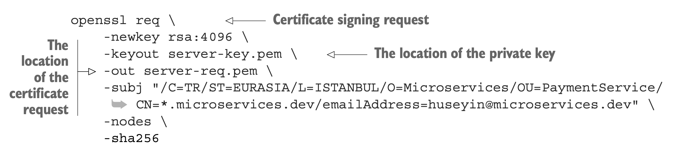
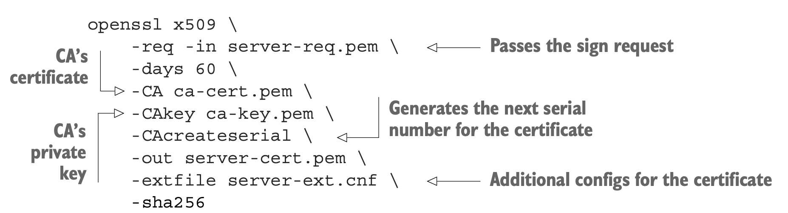

# Certificates Creation

## Create CA
```
openssl req -x509 \
-sha256 \
-newkey rsa:4096 \
-days 365 \
-keyout ca/ca-key.pem \
-out ca/ca-cert.pem \
-subj "/C=CO/ST=BOGOTA/L=BOGOTA/O=Software/OU=Microservices/CN=*.microservices.dev/emailAddress=sjulian9409@gmail.com" -nodes
```


### -subj Details
- /C is used for country.
- /ST is the state information.
- /L states city information.
- /O means organization.
- /OU is for the organization unit to explain which department.
- /CN is used for the domain name, the short version of common name.
- /emailAddress is used for an email address to contact the certificate owner.

### Verify CA Creation
```
openssl x509 -in ca/ca-cert.pem -noout -text
```

## Create PaymentService Certificate

### Create Signing request for PaymentService
```
openssl req -newkey rsa:4096 -keyout server/server-key.pem -out server/server-req.pem -subj "/C=CO/ST=BOGOTA/L=BOGOTA/O=Microservices/OU=PaymentService/CN=*.microservices.dev/emailAddress=sjulian9409@gmail.com" -nodes -sha256
```



### Sign the certificate with CA's private key
```
openssl x509 -req -in server/server-req.pem -days 60 -CA ca/ca-cert.pem -CAkey ca/ca-key.pem -CAcreateserial -out server/server-cert.pem -extfile server/server-ext.cnf -sha256
```


### Verify server certificate
```
openssl x509 -in server/server-cert.pem -noout -text
```

## Create Order Certificate

### Create Signing request for OrderService
```
openssl req -newkey rsa:4096 -keyout client/client-key.pem -out client/client-req.pem -subj "/C=CO/ST=BOGOTA/L=BOGOTA/O=Microservices/OU=OrderService/CN=*.microservices.dev/emailAddress=sjulian9409@gmail.com" -nodes -sha256
```
### Sign the certificate with CA's private key 
```
openssl x509 -req -in client/client-req.pem -days 60 -CA ca/ca-cert.pem -CAkey ca/ca-key.pem -CAcreateserial -out client/client-cert.pem -extfile client/client-ext.cnf -sha256
```
### Verify Client certificate
```
openssl x509 -in client/client-cert.pem -noout -text
```