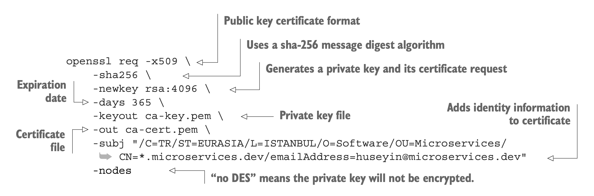

# Certificates Creation

## mTLS Flow


## Create CA
```
openssl req -x509 \
-sha256 \
-newkey rsa:4096 \
-days 365 \
-keyout ca/ca-key.pem \
-out ca/ca-cert.pem \
-subj "/C=CO/ST=BOGOTA/L=BOGOTA/O=Software/OU=Microservices/CN=*.microservices.dev/emailAddress=sjulian9409@gmail.com" -nodes
```



### -subj Details
- /C is used for country.
- /ST is the state information.
- /L states city information.
- /O means organization.
- /OU is for the organization unit to explain which department.
- /CN is used for the domain name, the short version of common name.
- /emailAddress is used for an email address to contact the certificate owner.

### Verify CA Creation
```
openssl x509 -in ca/ca-cert.pem -noout -text
```

## Create PaymentService Certificate

### Create Signing request for PaymentService
```
openssl req -newkey rsa:4096 -keyout server/server-key.pem -out server/server-req.pem -subj "/C=CO/ST=BOGOTA/L=BOGOTA/O=Microservices/OU=PaymentService/CN=*.microservices.dev/emailAddress=sjulian9409@gmail.com" -nodes -sha256
```


### Sign the certificate with CA's private key
```
openssl x509 -req -in server/server-req.pem -days 60 -CA ca/ca-cert.pem -CAkey ca/ca-key.pem -CAcreateserial -out server/server-cert.pem -extfile server/server-ext.cnf -sha256
```


### Verify server certificate
```
openssl x509 -in server/server-cert.pem -noout -text
```

## Create Order Certificate

### Create Signing request for OrderService
```
openssl req -newkey rsa:4096 -keyout client/client-key.pem -out client/client-req.pem -subj "/C=CO/ST=BOGOTA/L=BOGOTA/O=Microservices/OU=OrderService/CN=*.microservices.dev/emailAddress=sjulian9409@gmail.com" -nodes -sha256
```
### Sign the certificate with CA's private key 
```
openssl x509 -req -in client/client-req.pem -days 60 -CA ca/ca-cert.pem -CAkey ca/ca-key.pem -CAcreateserial -out client/client-cert.pem -extfile client/client-ext.cnf -sha256
```
### Verify Client certificate
```
openssl x509 -in client/client-cert.pem -noout -text
```

## grpc TLS config


- reference: https://github.com/huseyinbabal/grpc-microservices-in-go/blob/main/ch06/listing_6.8/server/server.go

``` go
package main

import (
	"context"
	"crypto/tls"
	"crypto/x509"
	"errors"
	"fmt"
	"google.golang.org/grpc"
	"google.golang.org/grpc/credentials"
	"io/ioutil"
	order "listing_6.8"
	"log"
	"net"
)

type server struct {
	order.UnimplementedOrderServiceServer
}

func getTlsCredentials() (credentials.TransportCredentials, error) {
	serverCert, serverCertErr := tls.LoadX509KeyPair("cert/server.crt", "cert/server.key")
	if serverCertErr != nil {
		return nil, fmt.Errorf("could not load server key pairs: %s", serverCertErr)
	}

	certPool := x509.NewCertPool()
	caCert, caCertErr := ioutil.ReadFile("cert/ca.crt")
	if caCertErr != nil {
		return nil, fmt.Errorf("could not read CA cert: %s", caCertErr)
	}

	if ok := certPool.AppendCertsFromPEM(caCert); !ok {
		return nil, errors.New("failed to append the CA certs")
	}

	return credentials.NewTLS(
		&tls.Config{
			ClientAuth:   tls.RequireAnyClientCert,
			Certificates: []tls.Certificate{serverCert},
			ClientCAs:    certPool,
		}), nil
}

func (s *server) Create(ctx context.Context, in *order.CreateOrderRequest) (*order.CreateOrderResponse, error) {
	return &order.CreateOrderResponse{OrderId: 1243}, nil
}

func main() {

	listener, err := net.Listen("tcp", fmt.Sprintf(":%d", 8080))
	if err != nil {
		log.Fatalf("failed to listen: %v", err)
	}
	tlsCredentials, tlsCredentialsErr := getTlsCredentials()
	if tlsCredentialsErr != nil {
		log.Fatal("cannot load server TLS credentials: ", tlsCredentialsErr)
	}
	var opts []grpc.ServerOption
	opts = append(opts, grpc.Creds(tlsCredentials))

	grpcServer := grpc.NewServer(opts...)
	order.RegisterOrderServiceServer(grpcServer, &server{})
	grpcServer.Serve(listener)
}
```
